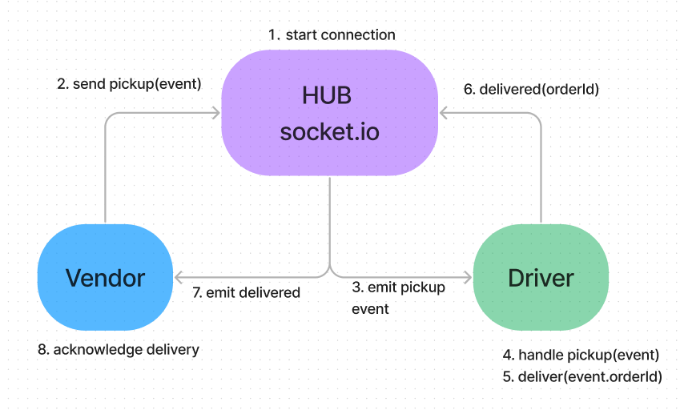

# LAB - Class 12

## Project: Socket.io

### Author: Ezgi Coban

### Links and Resources

- [ci/cd](https://github.com/ezgi-c/caps/actions) (GitHub Actions)
<!-- - [back-end server url](https://auth-api-2.onrender.com/) -->
<!-- - [front-end application](http://xyz.com) (when applicable) -->

### Setup

<!-- #### `.env` requirements (where applicable) -->

#### How to initialize/run your application (where applicable)

- `npm run hub`
- `npm run driver`
- `npm run vendor`

<!-- #### How to use your library (where applicable) -->

#### Tests

- How do you run tests?
    `npm test` , `npm run lint`
- Any tests of note?
    hub connection, driver-handler and vendor-handler tests
<!-- - Describe any tests that you did not complete, skipped, etc -->

#### UML

